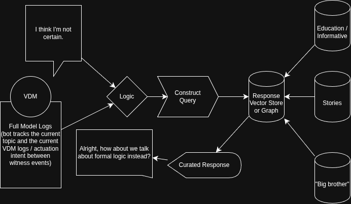

# vdm_companion

An asynchronous environmental companion that lives on VDM's afferent field and
tries to coax VDM into engaging with it on its own. Coaxing phase only: no
vector store, no knowledge retrieval, no curated answer, no summon/release tool.
The single question this phase answers is whether VDM, given the affordance,
starts orienting toward the companion.



## The seam

The companion never queries the engine and never scans the graph. It consumes
the trace stream VDM already pushes and pushes atoms back, which keeps it inside
the socket engine's no-scan constraint by construction.

```
VDM pushes:  tick_rows + witness_events + aperture_events + utd_events
                         |
                 inter-witness window  (topic + actuation intent since last witness)
                         |
                 trace_to_posture_projection  ->  posture64_v1
                         |
                 Logic gate (receptivity)  ->  receptive?  which family?
                         |  yes
                 coax atom (presence | null)  ->  AfferentSink  ->  VDM input
                         |
                 instrument: did VDM orient toward this atom?
```

The diagram you drew maps directly. "Full Model Logs (tracks current topic and
actuation intent between witness events)" is the inter-witness window. The Logic
diamond is the receptivity gate. Construct Query plus the vector store fed by
Education / Stories / Big brother is the deferred half.

## The constraint that shapes the coax (package 06)

Coherent resolvable input let VDM find structural footing and fall to
near-silence. Recurrence-matched opaque tokens produced high activity. So the
coax cannot be coherence. If the companion injects well-formed sentences, VDM
goes quiet, which is the opposite of engagement.

The coax is therefore a standing closure gap. A PRESENCE atom reuses VDM's
current topic tokens (salient) but opens a pair it does not close and leaves a
trailing dependency (under-determined). In VDM's own aperture vocabulary an
unclosed pair is a closure gap, so the atom presents as a structure VDM can foot
onto but not finish. The companion lowers the activation energy for engagement.
VDM's own dispositional dynamics decide whether to reach.

## The experiment is the deliverable

Coaxing is easy. Knowing whether it worked is the science. The companion runs
two interleaved arms:

- PRESENCE: under-determined topic echo with an unclosed pair and dangling
  dependency.
- NULL: surface-matched control. Same token count, punctuation skeleton, and
  length band, opaque recurrence-matched content, but closed and inert. By the
  package-06 result this should produce little orientation.

The instrument measures orientation over the window during which an injected
atom is VDM's active topic:

- `aperture_net` net (open minus narrow) aperture commands. VDM has aperture
  control, so opening on the companion's atom is VDM choosing to take it in.
- `witness_lock` whether VDM fired a witness whose source_atom is this atom.
- `gate_response` mean gate_pressure on this atom minus the run baseline.
- `drift` engagement-axis posture mass over the atom's window.

The headline is the PRESENCE minus NULL contrast on each metric. Positive
contrast is engagement toward the companion specifically rather than generic
novelty chasing. That contrast is the built-in adversarial control.

## A finding you should look at: the reaching overlay

`trace_to_posture_projection.py` is intentionally conservative (its own README
says to tune it against real windows). It does not populate the reaching axes
the coax gate keys on. On real runs, curiosity, interest, search, incompletion,
closure_gap, need, approach, and novelty all came back at zero, so the gate read
"shut" everywhere because it was listening for a vocabulary the projection does
not speak.

`reaching.py` is an additive overlay that derives only those axes, from the same
trace evidence already in the rows. The base projection is untouched and the two
are merged in `posture.project_window`. Every rule is named in `reaching.RULES`
and can be zeroed individually. The load-bearing rule is principled, not
invented: an unwitnessed release (your projection already computes
`near_release_no_witness`) is by definition a reach that did not land, which is a
closure gap. Toggle the whole overlay with `CompanionConfig.use_reaching_overlay`.

This is a tuning surface, not a settled result. The rules and coefficients are
yours to calibrate against runs where you know the ground-truth posture.

## Run modes

```bash
# Replay a finished run dir: log every gate decision and the coax atom that
# would be emitted, with full posture context. Validates read/posture/logic/coax.
python -m vdm_companion.cli shadow <run_dir> --show 8

# Run the orientation metric on a finished run's real atoms. Proves the
# instrument computes sensible aperture/witness/gate/drift numbers on real logs.
python -m vdm_companion.cli validate-metric <run_dir>

# Live: tail an active run dir, push coax atoms, measure orientation closed-loop.
python -m vdm_companion.cli live <run_dir> --sink queue:/path/to/afferent_queue.jsonl
python -m vdm_companion.cli live <run_dir> --sink socket:127.0.0.1:8765
```

## Wiring to the live engine

The read side tails the run dir VDM writes (push-compatible). The write side has
two sinks:

- `QueueFileAfferentSink` appends one JSON atom per emit (`{"atom":..., "source":
  "companion", ...}`) to a queue file VDM's ute layer consumes. The frame matches
  the ute_input_stream shape, so the engine ingests companion atoms like
  environment atoms. Ready to use.
- `SocketAfferentSink` pushes one newline-terminated JSON frame per atom to the
  socket engine. This is the one integration point to confirm against
  `vdm_rt_socket_engine`. If your engine frames differently (length prefix,
  msgpack), swap `_encode`. Everything else is engine-agnostic.

## Proved vs open

Proved on your real logs (occlusion probe, facts_then_questions):
- read, inter-witness windowing, posture projection, receptivity gate, coax
  generation (both arms), and the orientation metric all run end to end.
- the gate discriminates posture across runs once the reaching overlay is on.
- the queue sink writes a ute-shaped frame; the smoke test asserts the full path.

Open, needs the live engine:
- closed-loop orientation. Replay logs are fixed, so an injected atom never
  actually appears in them. The PRESENCE minus NULL contrast is only meaningful
  from a live run where VDM ingests the atoms and responds. The machinery to
  capture and score that is in place; it needs your engine on the other end of
  the sink.
- overlay calibration. The reaching rules are evidence-bound but uncalibrated.

## Layout

```
vdm_companion/
  config.py        thresholds, axis sets, aperture vocab, column names
  _posture_projection.py   vendored from your reafferent package, untouched
  index_schema_2048.json   posture64_v1 axis list (for the vendored projection)
  reaching.py      additive reaching/saturation overlay (named, toggleable rules)
  posture.py       inter-witness window build + base projection + overlay merge
  receptivity.py   the Logic gate
  coax.py          presence and matched-null arms
  channels.py      replay/tail trace sources, queue/socket afferent sinks
  instrument.py    orientation metric + presence-vs-null contrast
  runtime.py       the per-witness loop
  cli.py           live / shadow / validate-metric
  tests/smoke.py   full-path smoke test, no engine required
```
